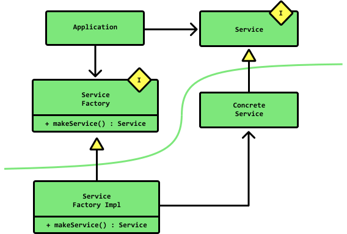
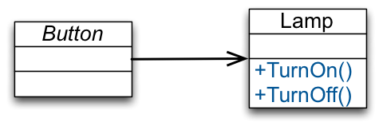
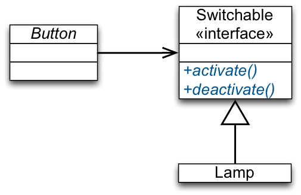

# Clean Code 

Example for Dependency Injection presentation

# Setup

Clone [xkcd-proxy](https://github.com/mjdye/xkcd-proxy)

```bash
git clone git@github.com:mjdye/xkcd-proxy.git
cd xkcd-proxy
npm install
npm run dev
```

Then run this app:

```bash
cd clean-code
npm install
PORT=3001 npm start
```

## Diagrams

### Boundaries: Main vs. App


### Before: Hardcoded


### After: Code to Abstractions
